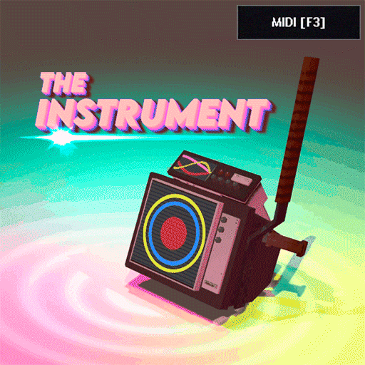

<p align="center">
  
</p>

<h1 align="center">The Instrument — MIDI Chooser</h1>

<p align="center">
  Play MIDI files through The Instrument in Garry's Mod — solo or together as a synchronised band.
  <br>
  <a href="https://steamcommunity.com/sharedfiles/filedetails/?id=3801703385"><strong>Steam Workshop</strong></a>
  ·
  <a href="https://steamcommunity.com/workshop/filedetails/?id=2718124784">Required: The Instrument</a>
</p>

## What it does

This companion addon adds MIDI playback to
[The Instrument](https://github.com/PinheadLarry1924/instrument). Pick a local
`.mid` or `.midi` file and the addon performs it through the equipped instrument.
Playback includes instrument selection, volume, transposition, speed, seeking,
pause, looping and optional drum muting.

### Band mode

Nearby players can join the performer as a band. The host's parsed song is streamed
to joiners in bounded chunks, so they do not need the same file on disk. Playback
is phase-locked to the host with latency compensation and periodic drift correction.

The transfer protocol accepts at most 24 chunks of 24 KB (roughly 576 KB compressed),
times out after 20 seconds and validates the decompressed note data before playback.

## Installation

### Steam Workshop

1. Subscribe to [The Instrument](https://steamcommunity.com/workshop/filedetails/?id=2718124784).
2. Subscribe to [The Instrument — MIDI Chooser](https://steamcommunity.com/sharedfiles/filedetails/?id=3801703385).
3. Restart Garry's Mod if it was already running.

### Manual

Place this repository in `garrysmod/addons/TheInstrument_MIDI/`. The important paths are:

```text
lua/autorun/client/cl_instrument_midi.lua
lua/autorun/server/sv_instrument_midi.lua
lua/the_instrument_midi/midi_core.lua
```

The autorun files load the shared core automatically.

## Usage

Put MIDI files into:

```text
garrysmod/data/the_instrument_midi/
```

The folder is created automatically. Equip The Instrument and open the chooser with
the on-screen **MIDI [F3]** button, the F3 key or:

```text
the_instrument_midi
```

When another nearby player is performing, use **Join Band** to follow their playback.
Each member keeps their own instrument, volume and transposition settings.

## Limits and security

The addon treats MIDI files and multiplayer data as untrusted input:

- local MIDI files are limited to 4 MB, 512 tracks, 400,000 events, 200,000 playable
  notes and 24 hours;
- streamed songs are limited before and after decompression, then every timestamp,
  note, velocity and channel is validated;
- only safe `.mid` and `.midi` basenames may be opened from the data directory;
- the server verifies instrument ownership and only accepts the instrument's actual
  parent amplifier as a remote speaker;
- note emission uses client and server token buckets, distance-limited recipients and
  bounded per-frame work;
- join transfers have per-host session limits, timeouts, duplicate detection, byte
  limits and chunk pacing.

Very dense passages can still lose notes deliberately: keeping the game and server
responsive takes priority over reproducing every event.

## ConVars

Client:

| ConVar | Default | Meaning |
|---|---:|---|
| `theinstrument_midi_note_rate` | `80` | Maximum notes per second emitted by this client |

Server:

| ConVar | Default | Meaning |
|---|---:|---|
| `theinstrument_midi_note_radius` | `2500` | Maximum distance at which a note is relayed |
| `theinstrument_midi_note_rate` | `120` | Maximum accepted notes per second from one player |
| `theinstrument_midi_action_cooldown` | `0.2` | Cooldown for play, pause and stop actions |
| `theinstrument_midi_slider_cooldown` | `0.03` | Cooldown for seek, speed and sync actions |
| `theinstrument_midi_join_cooldown` | `1` | Cooldown between join requests |
| `theinstrument_midi_patch_relay` | `1` | `1` uses unreliable note delivery; `0` uses reliable delivery. Both modes are validated |

## Project structure

- `midi_core.lua` — dependency-free MIDI parser, streamed-song validation and binary
  timeline search.
- `cl_instrument_midi.lua` — playback engine, band client and Derma interface.
- `sv_instrument_midi.lua` — authoritative band/session state and validated note relay.
- `tests/test_midi_core.lua` — parser, validation, filename and timeline regression tests.

The core tests run in CI with LuaJIT. Locally:

```bash
luajit tests/test_midi_core.lua
```

## Credits and license

Addon by **dmbai**. Built for
[The Instrument](https://github.com/PinheadLarry1924/instrument) by PinheadLarry1924.

Released under the [MIT License](LICENSE).
